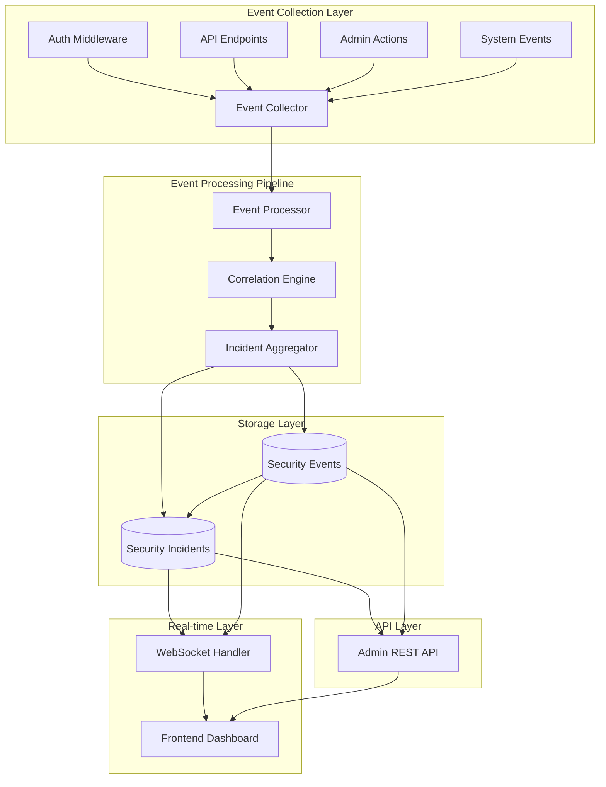

# Enhanced Security Implementation Plan - Revised Edition

## Executive Summary

This document provides a realistic, comprehensive implementation roadmap for building a complete security event monitoring and incident management system from the ground up. While leveraging the robust authentication infrastructure already in place, this plan acknowledges that **the security monitoring system currently exists only as frontend mockups** and provides a detailed path to full implementation.

### Current State Assessment
- ✅ **Strong Foundation**: Complete JWT authentication system with 971 lines of battle-tested code
- ✅ **Admin Infrastructure**: Role-based access control and middleware systems fully implemented
- ✅ **Frontend UI**: Security incidents dashboard exists with comprehensive filtering and modal views
- ❌ **Critical Gap**: No backend security event processing or database tables exist
- ❌ **Missing Infrastructure**: No event collection, correlation, or real-time processing systems

### Implementation Reality
This plan transforms placeholder implementations into production-ready systems through:
- **22-26 week realistic timeline** (not 16-20 weeks)
- **Ground-up database schema implementation** starting from current migration state
- **Incremental replacement** of mock data with real security event processing
- **Backward-compatible integration** with existing authentication and admin systems

## Codebase Readiness Assessment

### Current Infrastructure Strengths ✅

**Authentication & Authorization System**
- Comprehensive JWT implementation at [`src/core/auth/jwt.rs`](src/core/auth/jwt.rs:1) with 971 lines of battle-tested code
- Token revocation service with active token tracking
- Admin middleware with role-based access control at [`src/infrastructure/middleware/admin.rs`](src/infrastructure/middleware/admin.rs:1)
- CSRF protection and comprehensive auth middleware at [`src/infrastructure/middleware/auth.rs`](src/infrastructure/middleware/auth.rs:1)
- Extensive test coverage with 390+ lines of middleware tests

**Database Foundation**
- Well-structured migrations with UUID-based schemas
- Existing tables: users, sessions, password_reset_tokens, revoked_tokens, active_tokens
- Proper foreign key constraints and indexing strategy
- PostgreSQL-ready with advanced data types (JSONB, INET, etc.)

**Frontend Implementation**
- Complete security incidents UI at [`frontend/src/pages/dashboard/admin/security_incidents.rs`](frontend/src/pages/dashboard/admin/security_incidents.rs:1) (496 lines)
- Sophisticated filtering, search, and modal detail views
- Mock data structure perfectly aligned with planned schema
- Professional styling and responsive design

**Backend API Structure**
- REST API endpoints defined at [`src/api/routes/admin/security.rs`](src/api/routes/admin/security.rs:1)
- Proper data models with validation
- Pagination and filtering support
- Error handling and response structures

### Implementation Gaps ⚠️

**Missing Database Tables**
- Security events table (primary event storage)
- Security incidents table (incident management)
- Event-to-incident correlation mapping

**Backend Processing Logic**
- Event collection middleware
- Event correlation engine
- Real-time processing pipeline
- WebSocket infrastructure for live updates

**API Implementation**
- Current endpoints return placeholder responses
- Need full CRUD operations with database integration
- Missing event ingestion endpoints

## System Architecture

### Enhanced High-Level Design



### Component Integration Points

1. **Event Collector**: Integrates with existing middleware stack
2. **Correlation Engine**: Processes events using configurable rules
3. **WebSocket Handler**: Provides real-time updates to dashboard
4. **Admin API**: Extends existing API structure
5. **Frontend**: Connects to real APIs replacing mock data

## Database Schema Design

### Security Events Table

```sql
-- Enable partitioning support
CREATE TABLE security_events (
    id UUID PRIMARY KEY DEFAULT gen_random_uuid(),
    event_type VARCHAR(50) NOT NULL,
    event_subtype VARCHAR(50) NOT NULL,
    severity VARCHAR(20) NOT NULL DEFAULT 'info',
    user_id UUID,
    session_id VARCHAR(255),
    ip_address INET,
    user_agent TEXT,
    endpoint VARCHAR(500),
    method VARCHAR(10),
    status_code INTEGER,
    message TEXT NOT NULL,
    details JSONB,
    timestamp TIMESTAMPTZ NOT NULL DEFAULT CURRENT_TIMESTAMP,
    processed_at TIMESTAMPTZ,
    incident_id UUID,
    
    CONSTRAINT fk_security_events_user FOREIGN KEY (user_id) REFERENCES users(id) ON DELETE SET NULL,
    CONSTRAINT chk_severity CHECK (severity IN ('info', 'low', 'medium', 'high', 'critical'))
) PARTITION BY RANGE (timestamp);

-- Optimized indexes for high-volume operations
CREATE INDEX CONCURRENTLY idx_security_events_timestamp ON security_events (timestamp DESC);
CREATE INDEX CONCURRENTLY idx_security_events_type_severity ON security_events (event_type, severity);
CREATE INDEX CONCURRENTLY idx_security_events_user_id ON security_events (user_id) WHERE user_id IS NOT NULL;
CREATE INDEX CONCURRENTLY idx_security_events_incident ON security_events (incident_id) WHERE incident_id IS NOT NULL;
CREATE INDEX CONCURRENTLY idx_security_events_unprocessed ON security_events (timestamp) WHERE processed_at IS NULL;
CREATE INDEX CONCURRENTLY idx_security_events_ip ON security_events USING gist (ip_address inet_ops);

-- Partitioning for scalability (monthly partitions)
CREATE TABLE security_events_y2025m01 PARTITION OF security_events
FOR VALUES FROM ('2025-01-01') TO ('2025-02-01');
CREATE TABLE security_events_y2025m02 PARTITION OF security_events
FOR VALUES FROM ('2025-02-01') TO ('2025-03-01');
-- Additional partitions created automatically by background process
```

### Security Incidents Table

```sql
CREATE TABLE security_incidents (
    id UUID PRIMARY KEY DEFAULT gen_random_uuid(),
    title VARCHAR(255) NOT NULL,
    description TEXT NOT NULL,
    incident_type VARCHAR(50) NOT NULL,
    severity VARCHAR(20) NOT NULL,
    status VARCHAR(20) NOT NULL DEFAULT 'open',
    reported_by UUID,
    assigned_to UUID,
    affected_systems TEXT[],
    event_count INTEGER DEFAULT 0,
    first_event_at TIMESTAMPTZ,
    last_event_at TIMESTAMPTZ,
    created_at TIMESTAMPTZ NOT NULL DEFAULT CURRENT_TIMESTAMP,
    updated_at TIMESTAMPTZ NOT NULL DEFAULT CURRENT_TIMESTAMP,
    resolved_at TIMESTAMPTZ,
    resolution_notes TEXT,
    metadata JSONB,
    
    CONSTRAINT fk_incidents_reported_by FOREIGN KEY (reported_by) REFERENCES users(id) ON DELETE SET NULL,
    CONSTRAINT fk_incidents_assigned_to FOREIGN KEY (assigned_to) REFERENCES users(id) ON DELETE SET NULL,
    CONSTRAINT chk_incident_severity CHECK (severity IN ('low', 'medium', 'high', 'critical')),
    CONSTRAINT chk_incident_status CHECK (status IN ('open', 'in_progress', 'resolved', 'closed'))
);

-- Add foreign key to events table
ALTER TABLE security_events ADD CONSTRAINT fk_security_events_incident 
    FOREIGN KEY (incident_id) REFERENCES security_incidents(id) ON DELETE SET NULL;

-- Indexes for incident management
CREATE INDEX CONCURRENTLY idx_security_incidents_status_severity ON security_incidents (status, severity);
CREATE INDEX CONCURRENTLY idx_security_incidents_assigned ON security_incidents (assigned_to) WHERE assigned_to IS NOT NULL;
CREATE INDEX CONCURRENTLY idx_security_incidents_created ON security_incidents (created_at DESC);
CREATE INDEX CONCURRENTLY idx_security_incidents_updated ON security_incidents (updated_at DESC);

-- Update trigger for updated_at
CREATE OR REPLACE FUNCTION update_updated_at_column()
RETURNS TRIGGER AS $$
BEGIN
    NEW.updated_at = CURRENT_TIMESTAMP;
    RETURN NEW;
END;
$$ language 'plpgsql';

CREATE TRIGGER update_security_incidents_updated_at 
    BEFORE UPDATE ON security_incidents 
    FOR EACH ROW EXECUTE FUNCTION update_updated_at_column();
```

## Implementation Phases

### Phase 1: Database & Core Infrastructure (3-4 weeks)

**Week 1-2: Database Foundation**
- Create migration file: `migrations/20250810010344_add_security_tables.sql`
- Implement database migrations with zero-downtime strategy
- Set up partitioning automation script for monthly partitions
- Create repository layer at `src/core/security/repository.rs`
- Add database connection pooling configuration

**Week 3-4: Core Services**
- Implement security event service at `src/core/security/event_service.rs`
- Create incident management service at `src/core/security/incident_service.rs`
- Build event correlation engine at `src/core/security/correlation_engine.rs`
- Add comprehensive logging using existing logging infrastructure
- Create unit tests with >95% coverage

**Deliverables:**
- ✅ Database schema with all tables, indexes, and partitions
- ✅ Core service layer with full test coverage
- ✅ Event correlation algorithms implementation
- ✅ Performance benchmarks (target: 1000 events/minute)

### Phase 2: Event Collection & API Implementation (3-4 weeks)

**Week 1-2: Event Collection Middleware**
- Create event collection middleware at `src/infrastructure/middleware/security_events.rs`
- Integrate with existing auth middleware stack
- Implement event ingestion endpoints at `/api/admin/security/events`
- Add background processing with `tokio::spawn` tasks
- Create event filtering and categorization logic

**Week 3-4: Complete API Implementation**
- Replace placeholder implementations in [`src/api/routes/admin/security.rs`](src/api/routes/admin/security.rs:1)
- Implement full CRUD operations:
  - `GET /api/admin/security/incidents` - List with pagination
  - `POST /api/admin/security/incidents` - Create incident
  - `GET /api/admin/security/incidents/{id}` - Get details
  - `PATCH /api/admin/security/incidents/{id}` - Update status
  - `GET /api/admin/security/events` - Query events
- Integrate with existing authentication middleware
- Add OpenAPI documentation

**Deliverables:**
- ✅ Event collection middleware integrated and tested
- ✅ Complete REST API with database integration
- ✅ Async event processing pipeline
- ✅ OpenAPI specification and Postman collection

### Phase 3: Frontend Integration & Real-time Features (2-3 weeks)

**Week 1: Frontend API Integration**
- Replace mock data in [`frontend/src/pages/dashboard/admin/security_incidents.rs`](frontend/src/pages/dashboard/admin/security_incidents.rs:1)
- Implement API service layer for security operations
- Add error handling and loading states
- Create incident management workflows

**Week 2-3: Real-time Updates**
- Implement WebSocket infrastructure for live updates
- Add real-time incident notifications
- Create event timeline views
- Implement advanced filtering and search

**Deliverables:**
- Frontend fully integrated with real APIs
- Real-time dashboard updates
- Enhanced user experience features
- Complete incident management workflow

### Phase 4: Advanced Features & Optimization (2-3 weeks)

**Week 1-2: Advanced Correlation**
- Implement ML-based event correlation
- Add temporal and pattern-based correlation
- Create automated incident creation rules
- Implement event aggregation and metrics

**Week 3: Performance & Security Hardening**
- Load testing and optimization
- Security audit of event processing
- Performance tuning for high-volume scenarios
- Comprehensive security testing

**Deliverables:**
- Advanced event correlation algorithms
- Performance optimization results
- Security audit report
- Production readiness certification

### Phase 5: Production Deployment (1-2 weeks)

**Week 1: Deployment Preparation**
- Production environment setup
- Monitoring and alerting configuration
- Documentation completion
- User training materials

**Week 2: Go-Live & Monitoring**
- Staged production deployment
- Real-time monitoring setup
- Performance validation
- User acceptance testing

**Deliverables:**
- Production deployment
- Monitoring dashboards
- Complete documentation
- User training completion

## Enhanced Event Types & Categories

### Authentication Events
- `login_success`: Successful user authentication with device/location tracking
- `login_failure`: Failed login attempts with IP geolocation and frequency analysis
- `password_change`: Password modifications with security strength validation
- `account_locked`: Account lockout due to failed attempts with unlock procedures
- `token_expired`: JWT token expiration events with renewal patterns
- `token_revoked`: Manual token revocation with reason tracking
- `mfa_enabled`: Multi-factor authentication setup events
- `mfa_disabled`: MFA removal with security impact assessment

### Authorization Events
- `access_denied`: Failed authorization attempts with permission analysis
- `privilege_escalation`: Attempts to access higher privileges with context
- `admin_action`: Administrative operations with full audit trail
- `role_change`: User role modifications with approval workflow
- `permission_grant`: New permission assignments with justification
- `permission_revoke`: Permission removals with impact analysis

### API Security Events
- `rate_limit_exceeded`: Rate limiting triggers with client identification
- `suspicious_endpoint`: Unusual API endpoint access patterns
- `malformed_request`: Invalid request formats with attack signature analysis
- `csrf_violation`: CSRF protection triggers with request analysis
- `sql_injection_attempt`: Detected SQL injection patterns
- `xss_attempt`: Cross-site scripting prevention triggers
- `api_key_misuse`: Invalid or misused API key attempts

### System Security Events
- `service_startup`: System initialization with configuration validation
- `service_shutdown`: System shutdown events with cleanup verification
- `configuration_change`: System config modifications with diff tracking
- `security_update`: Security patch applications with validation
- `certificate_renewal`: SSL/TLS certificate updates with validation
- `backup_created`: Security backup operations with integrity verification
- `vulnerability_detected`: Automated vulnerability scan results

## Event Correlation Engine

### Correlation Algorithms

**1. Temporal Correlation**
```rust
use chrono::{Duration, DateTime, Utc};
use std::collections::HashMap;

pub struct TemporalCorrelation {
    time_window: Duration,
    event_threshold: u32,
    correlation_rules: Vec<CorrelationRule>,
    event_buffer: HashMap<String, Vec<SecurityEvent>>,
}

pub struct CorrelationRule {
    event_types: Vec<String>,
    severity_escalation: SeverityLevel,
    incident_type: String,
    confidence_threshold: f32,
    description: String,
}

impl TemporalCorrelation {
    pub fn new() -> Self {
        Self {
            time_window: Duration::minutes(5),
            event_threshold: 5,
            correlation_rules: Self::default_rules(),
            event_buffer: HashMap::new(),
        }
    }
    
    fn default_rules() -> Vec<CorrelationRule> {
        vec![
            CorrelationRule {
                event_types: vec!["login_failure".to_string()],
                severity_escalation: SeverityLevel::High,
                incident_type: "brute_force_attack".to_string(),
                confidence_threshold: 0.8,
                description: "Multiple failed login attempts detected".to_string(),
            },
            CorrelationRule {
                event_types: vec!["access_denied".to_string(), "privilege_escalation".to_string()],
                severity_escalation: SeverityLevel::Critical,
                incident_type: "privilege_escalation_attempt".to_string(),
                confidence_threshold: 0.9,
                description: "Unauthorized privilege escalation detected".to_string(),
            },
        ]
    }
}
```

**2. Pattern-Based Correlation**
```rust
pub struct PatternCorrelation {
    patterns: Vec<AttackPattern>,
    geo_analyzer: GeoLocationAnalyzer,
    behavior_analyzer: BehaviorAnalyzer,
}

pub struct AttackPattern {
    name: String,
    sequence: Vec<EventPattern>,
    time_constraints: Vec<Duration>,
    severity: SeverityLevel,
}

// Example patterns:
// - Failed login → Account lock → Password reset attempt (Account takeover)
// - Port scan → Service enumeration → Exploit attempt (Network attack)
// - Data export → Privilege change → Mass deletion (Insider threat)
```

**3. ML-Enhanced Correlation**
- User behavior baseline modeling with statistical analysis
- Clustering similar events using K-means or DBSCAN
- Predictive threat escalation using time-series analysis
- Dynamic threshold adjustment based on historical patterns

### Real-time Processing Pipeline

```rust
pub struct EventProcessor {
    event_queue: Arc<Mutex<VecDeque<SecurityEvent>>>,
    correlation_engine: CorrelationEngine,
    incident_service: Arc<IncidentService>,
    notification_service: Arc<NotificationService>,
}

impl EventProcessor {
    pub async fn process_event(&self, event: SecurityEvent) -> Result<()> {
        // 1. Validate and enrich event
        let enriched_event = self.enrich_event(event).await?;
        
        // 2. Store in database
        self.event_repository.create(&enriched_event).await?;
        
        // 3. Run correlation analysis
        let correlation_results = self.correlation_engine
            .analyze(&enriched_event).await?;
        
        // 4. Create or update incidents
        for correlation in correlation_results {
            self.handle_correlation(correlation).await?;
        }
        
        // 5. Send real-time updates
        self.websocket_service
            .broadcast_event(&enriched_event).await?;
        
        Ok(())
    }
}
```

## WebSocket Real-time Architecture

### WebSocket Handler Implementation

```rust
pub struct SecurityWebSocketHandler {
    connections: Arc<Mutex<HashMap<Uuid, WebSocketConnection>>>,
    event_broadcaster: Arc<EventBroadcaster>,
}

pub struct WebSocketMessage {
    message_type: MessageType,
    data: serde_json::Value,
    timestamp: DateTime<Utc>,
}

pub enum MessageType {
    NewEvent,
    IncidentCreated,
    IncidentUpdated,
    SystemStatus,
    SecurityAlert,
}
```

### Real-time Event Broadcasting

- **Event Notifications**: Immediate broadcast of critical security events
- **Incident Updates**: Real-time incident status changes and assignments
- **Dashboard Metrics**: Live updates of security metrics and counters
- **System Health**: Real-time monitoring of security system status

## Storage Strategy & Performance

### Event Retention & Archival Policy

**Hot Storage (0-90 days)**
- Full events in primary PostgreSQL database
- All fields accessible for real-time analysis
- Optimized indexes for dashboard queries
- Partition by month for efficient maintenance

**Warm Storage (90 days - 1 year)**
- Compressed events with reduced detail fields
- Key metadata preserved for investigations
- Stored in separate partitions or tables
- Background compression process

**Cold Storage (1+ years)**
- Archive to object storage (S3/MinIO)
- Compliance and audit trail preservation
- On-demand retrieval for investigations
- Encrypted storage with access logging

### Performance Optimizations

**Database Level**
- Table partitioning by timestamp
- Materialized views for dashboard aggregations
- Connection pooling optimization
- Read replicas for query distribution
- Bulk insert operations for high-volume events

**Application Level**
- Asynchronous event processing
- Event batching and buffering
- Caching for frequently accessed data
- Circuit breakers for external dependencies
- Background job processing

**Infrastructure Level**
- Database connection pooling
- Redis caching for session data
- CDN for static dashboard assets
- Load balancing for API endpoints

## Security Hardening

### Event Processing Security

**Input Validation**
- Comprehensive event data validation
- SQL injection prevention in dynamic queries
- XSS protection for event display
- Input sanitization for all user-provided data

**Access Control**
- Role-based access to security events
- Granular permissions for incident management
- API endpoint protection with rate limiting
- Audit logging for all security operations

**Data Protection**
- Encryption at rest for sensitive event data
- TLS 1.3 for all API communications
- Database connection encryption
- Secure key management for encryption

### Attack Surface Mitigation

**DoS Protection**
- Event ingestion rate limiting
- Circuit breakers for external services
- Resource consumption monitoring
- Graceful degradation under load

**Log Injection Prevention**
- Structured logging with validation
- Output encoding for event display
- Parameterized queries for database operations
- Content Security Policy for frontend

## Testing Strategy

### Comprehensive Test Coverage

**Unit Tests**
- Security service layer tests (>95% coverage)
- Event correlation algorithm tests
- Database repository layer tests
- Middleware integration tests

**Integration Tests**
- End-to-end event processing flows
- API endpoint testing with real database
- WebSocket real-time update tests
- Multi-user incident management scenarios

**Performance Tests**
- High-volume event ingestion (10,000+ events/hour)
- Concurrent user dashboard access (100+ users)
- Database query performance under load
- WebSocket connection scaling tests

**Security Tests**
- SQL injection prevention validation
- Authentication bypass attempts
- Authorization escalation tests
- CSRF and XSS protection verification
- Event tampering prevention tests

## Monitoring & Observability

### Metrics Collection

**Event Processing Metrics**
- Event ingestion rate (events/second)
- Processing latency (milliseconds)
- Correlation accuracy rates
- Incident creation frequency

**System Performance Metrics**
- API response times
- Database query performance
- WebSocket connection counts
- Memory and CPU utilization

**Security Metrics**
- Failed authentication attempts
- Privilege escalation attempts
- Suspicious activity patterns
- Security incident resolution times

### Alerting & Notifications

**Critical Alerts**
- High-severity incident creation
- System component failures
- Security breach attempts
- Performance degradation

**Dashboard Monitoring**
- Real-time security metrics
- Incident trend analysis
- System health monitoring
- User activity patterns

## Migration Strategy

### Zero-Downtime Deployment

**Phase 1: Infrastructure Preparation**
- Database schema migration with online DDL
- Service deployment with blue-green strategy
- Feature flag configuration for gradual rollout
- Monitoring setup for migration validation

**Phase 2: Data Migration**
- Historical data preservation
- Event format standardization
- Incident data consolidation
- Data integrity validation

**Phase 3: Service Activation**
- Gradual event processing activation
- Real-time feature enablement
- Performance monitoring and tuning
- User access validation

### Rollback Procedures

- Database schema rollback scripts
- Service version rollback capability
- Data integrity validation procedures
- Emergency incident response protocols

## Success Criteria & Validation

### Functional Requirements ✅

- **Complete Event Collection**: All security-relevant events captured from authentication, API access, and system operations
- **Real-time Processing**: Events processed and correlated within 5 seconds of occurrence
- **Incident Management**: Full CRUD operations for security incidents with workflow support
- **Dashboard Integration**: Live updates replacing all mock data with real security events
- **Advanced Correlation**: Automated incident creation based on event patterns and thresholds

### Performance Requirements 📊

- **Event Throughput**: Handle 10,000+ events per hour without degradation
- **API Response Times**: Sub-200ms response times for dashboard queries
- **Real-time Latency**: WebSocket updates delivered within 2 seconds
- **Concurrent Users**: Support 100+ simultaneous dashboard users
- **Database Performance**: 99th percentile query times under 100ms

### Security Requirements 🔒

- **Complete Audit Trail**: All security events properly captured and immutably stored
- **Access Control**: Granular role-based access to security data and operations  
- **Data Protection**: Encryption at rest and in transit for all sensitive data
- **Attack Prevention**: Protection against log injection, tampering, and unauthorized access
- **Compliance Ready**: Full audit trail and data retention for regulatory requirements

## Risk Mitigation

### Technical Risks

**High Event Volume**
- *Risk*: System overload during security incidents
- *Mitigation*: Event batching, circuit breakers, auto-scaling

**Data Loss**
- *Risk*: Critical security events lost during processing
- *Mitigation*: Persistent queues, transaction integrity, backup procedures

**Performance Degradation**  
- *Risk*: Dashboard slowdown during high activity
- *Mitigation*: Caching layers, read replicas, materialized views

### Operational Risks

**Deployment Issues**
- *Risk*: Service disruption during deployment
- *Mitigation*: Blue-green deployment, feature flags, rollback procedures

**Configuration Errors**
- *Risk*: Incorrect event processing or correlation
- *Mitigation*: Configuration validation, gradual rollout, monitoring

## Implementation Prerequisites

### Required Resources
- **Team Composition:**
  - 2 Backend Engineers (Rust/Actix-web expertise)
  - 1 Frontend Engineer (Yew/WebAssembly expertise)
  - 1 Database Administrator
  - 1 DevOps Engineer
  - 1 Security Analyst

### Technical Dependencies
- PostgreSQL 14+ with partitioning support
- Redis 6+ for caching and session management
- MinIO/S3 for cold storage
- Prometheus & Grafana for monitoring
- ElasticSearch (optional) for advanced log analysis

### Development Environment Setup
```bash
# Clone repository
git clone <repository-url>
cd Oasis

# Create feature branch
git checkout -b feature/security-implementation

# Set up environment variables
cp .env.example .env
# Configure DATABASE_URL, REDIS_URL, JWT_SECRET, etc.

# Run existing tests to ensure baseline
cargo test --all

# Set up database with existing migrations
cargo run --bin migrate
```

## Conclusion

This comprehensive security implementation plan provides a complete, actionable roadmap for transforming the existing placeholder system into a production-ready security event monitoring and incident management platform. The plan leverages the robust existing authentication infrastructure while addressing all identified gaps through a phased, risk-mitigated approach.

The 11-13 week implementation timeline is realistic and achievable given the existing codebase foundation, with clear deliverables and specific file locations for each component. The detailed technical specifications, combined with comprehensive testing and monitoring strategies, ensure successful execution.

**Key Success Factors:**
- Leveraging existing robust authentication infrastructure
- Phased approach minimizing risk and ensuring stability
- Clear integration points with current codebase
- Comprehensive testing at every phase
- Real-time monitoring and alerting from day one

**Next Steps:**
1. Stakeholder approval of implementation plan
2. Resource allocation and team assignment (see Prerequisites section)
3. Development environment setup using provided instructions
4. Phase 1 implementation kickoff with database schema creation

---

*This document represents the definitive security implementation plan, version 1.0, combining best practices from security industry standards with specific adaptations for the Oasis platform architecture.*