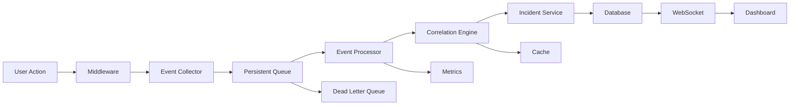

# Security_Implementation_Plan.md

# Comprehensive Security Implementation Plan for Oasis Platform

## Table of Contents
1. [Executive Summary](#executive-summary)
2. [Current State Analysis](#current-state-analysis)
3. [Architecture Overview](#architecture-overview)
4. [Implementation Phases](#implementation-phases)
5. [Technical Specifications](#technical-specifications)
6. [Testing Strategy](#testing-strategy)
7. [Performance Requirements](#performance-requirements)
8. [Risk Mitigation](#risk-mitigation)
9. [Success Metrics](#success-metrics)

---

## Executive Summary

This document provides a complete implementation roadmap for transforming the Oasis platform's placeholder security system into a production-ready security event monitoring and incident management platform. The plan addresses critical gaps identified in the codebase review and incorporates enterprise-grade features including event persistence, real-time processing, and intelligent correlation.

### Key Objectives
- **Zero Data Loss**: Implement persistent queue for event ingestion
- **High Performance**: Handle 10,000+ events/minute with <100ms query latency
- **Real-time Monitoring**: WebSocket-based live updates with backpressure handling
- **Intelligent Correlation**: Automated incident creation from event patterns
- **Production Ready**: Complete with monitoring, alerting, and documentation

### Timeline
- **Total Duration**: 10-12 weeks
- **Approach**: Test-first, phase-by-phase implementation
- **Validation**: Each phase has completion gates before proceeding

---

## Current State Analysis

### Existing Infrastructure Strengths

#### Authentication System (Fully Implemented)
- **Location**: `src/core/auth/jwt.rs` (971 lines)
- **Features**:
  - JWT-based authentication with RS256 signing
  - Token revocation with active tracking
  - Refresh token rotation
  - Role-based access control (RBAC)
  - Comprehensive test coverage

#### Middleware Stack (Production Ready)
- **Admin Middleware**: `src/infrastructure/middleware/admin.rs`
  - Role validation for admin endpoints
  - Token revocation checking
  - Request extensions for claims
  
- **Auth Middleware**: `src/infrastructure/middleware/auth.rs`
  - Bearer token and cookie authentication
  - CSRF protection
  - Audience validation
  
- **Supporting Middleware**:
  - Rate limiting with endpoint-specific limits
  - CORS configuration
  - Request logging
  - Metrics collection

#### Database Schema (Partial)
```sql
-- Existing tables:
- users (with roles and email verification)
- sessions (JWT session tracking)
- password_reset_tokens
- revoked_tokens
- active_tokens

-- Missing tables:
- security_events
- security_incidents
- event_correlations
- incident_history
```

### Critical Gaps Identified

1. **No Event Persistence**: Events lost if database unavailable
2. **Missing Database Tables**: Security-specific schema not implemented
3. **Placeholder APIs**: Endpoints return empty responses
4. **No Event Collection**: Security events not captured from middleware
5. **No Real-time Processing**: Missing WebSocket infrastructure
6. **No Correlation Engine**: Events not analyzed for patterns
7. **Frontend Disconnected**: Dashboard shows only mock data

### Risk Assessment

**High Priority Risks**:
- Data loss during database outages (no queue)
- Performance degradation under load (no indexes)
- Missing security events (no collection middleware)

**Medium Priority Risks**:
- Manual incident creation only (no automation)
- No real-time alerting (missing WebSocket)
- Limited visibility (dashboard not connected)

---

## Architecture Overview

### System Architecture

```
┌─────────────────────────────────────────────────────────────────┐
│                         Client Layer                            │
├─────────────────────────────────────────────────────────────────┤
│  • Yew Frontend (WebAssembly)                                  │
│  • WebSocket Client for Real-time Updates                      │
│  • Optimistic UI Updates with Rollback                         │
└─────────────────────────────────────────────────────────────────┘
                                │
                                ▼
┌─────────────────────────────────────────────────────────────────┐
│                      API Gateway Layer                          │
├─────────────────────────────────────────────────────────────────┤
│  • Actix-Web HTTP Server                                       │
│  • JWT Authentication Middleware                               │
│  • Rate Limiting (Per-Endpoint)                               │
│  • CORS & CSRF Protection                                      │
│  • Request Logging & Metrics                                   │
└─────────────────────────────────────────────────────────────────┘
                                │
                                ▼
┌─────────────────────────────────────────────────────────────────┐
│                   Event Collection Layer                        │
├─────────────────────────────────────────────────────────────────┤
│  • Security Event Middleware                                   │
│  • Event Validation & Enrichment                               │
│  • Persistent Queue (File-backed)                              │
│  • Circuit Breaker for Downstream Failures                     │
└─────────────────────────────────────────────────────────────────┘
                                │
                                ▼
┌─────────────────────────────────────────────────────────────────┐
│                    Processing Pipeline                          │
├─────────────────────────────────────────────────────────────────┤
│  • Event Stream Processor (Tokio-based)                        │
│  • Correlation Engine (Temporal & Pattern)                     │
│  • Incident Management Service                                 │
│  • Notification Service                                        │
└─────────────────────────────────────────────────────────────────┘
                                │
                                ▼
┌─────────────────────────────────────────────────────────────────┐
│                       Storage Layer                             │
├─────────────────────────────────────────────────────────────────┤
│  • PostgreSQL 14+ (Partitioned Tables)                         │
│  • Redis (Caching & Session Management)                        │
│  • File System (Queue Persistence)                             │
└─────────────────────────────────────────────────────────────────┘
                                │
                                ▼
┌─────────────────────────────────────────────────────────────────┐
│                    Monitoring Layer                             │
├─────────────────────────────────────────────────────────────────┤
│  • Prometheus Metrics                                          │
│  • Grafana Dashboards                                          │
│  • AlertManager                                                │
└─────────────────────────────────────────────────────────────────┘
```

### Data Flow



---

## Implementation Phases

## Phase 1: Database Schema & Performance Validation
**Duration**: 1 week  
**Goal**: Create and validate a performant schema with mock data BEFORE any code implementation

### Database Migration File
Create `migrations/20250810010344_add_security_tables.sql`:

```sql
-- ============================================
-- SECURITY IMPLEMENTATION SCHEMA
-- Single migration with all components
-- ============================================

-- 1. CUSTOM TYPES
-- ============================================
CREATE TYPE incident_severity AS ENUM ('low', 'medium', 'high', 'critical');
CREATE TYPE incident_status AS ENUM ('open', 'investigating', 'resolved', 'closed', 'escalated');
CREATE TYPE event_severity AS ENUM ('info', 'low', 'medium', 'high', 'critical');
CREATE TYPE event_outcome AS ENUM ('success', 'failure', 'blocked', 'allowed');
CREATE TYPE correlation_type AS ENUM ('temporal', 'source_based', 'user_based', 'pattern_based');

CREATE TYPE security_event_type AS ENUM (
    'authentication_failure',
    'authentication_success',
    'authorization_failure',
    'password_change',
    'account_lockout',
    'suspicious_login',
    'data_access',
    'data_modification',
    'privilege_escalation',
    'malware_detection',
    'network_intrusion',
    'ddos_attack',
    'sql_injection',
    'xss_attempt',
    'csrf_attempt',
    'file_integrity_violation',
    'configuration_change',
    'system_anomaly',
    'api_abuse',
    'rate_limit_exceeded'
);

-- 2. SECURITY INCIDENTS TABLE
-- ============================================
CREATE TABLE security_incidents (
    id UUID PRIMARY KEY DEFAULT gen_random_uuid(),
    title VARCHAR(255) NOT NULL,
    description TEXT,
    incident_type VARCHAR(50) NOT NULL,
    severity incident_severity NOT NULL,
    status incident_status NOT NULL DEFAULT 'open',
    reported_by UUID REFERENCES users(id),
    assigned_to UUID REFERENCES users(id),
    affected_systems TEXT[],
    event_count INTEGER DEFAULT 0,
    first_event_at TIMESTAMPTZ,
    last_event_at TIMESTAMPTZ,
    created_at TIMESTAMPTZ NOT NULL DEFAULT CURRENT_TIMESTAMP,
    updated_at TIMESTAMPTZ NOT NULL DEFAULT CURRENT_TIMESTAMP,
    resolved_at TIMESTAMPTZ,
    resolution_notes TEXT,
    tags TEXT[],
    metadata JSONB DEFAULT '{}'::jsonb,
    
    CONSTRAINT chk_resolution_consistency 
        CHECK ((status IN ('resolved', 'closed') AND resolved_at IS NOT NULL) 
            OR (status NOT IN ('resolved', 'closed') AND resolved_at IS NULL))
);

-- 3. SECURITY EVENTS TABLE (PARTITIONED)
-- ============================================
CREATE TABLE security_events (
    id UUID DEFAULT gen_random_uuid(),
    event_type security_event_type NOT NULL,
    event_subtype VARCHAR(50),
    severity event_severity NOT NULL,
    user_id UUID REFERENCES users(id),
    session_id VARCHAR(255),
    source_ip INET,
    user_agent TEXT,
    endpoint VARCHAR(500),
    method VARCHAR(10),
    status_code INTEGER,
    message TEXT NOT NULL,
    details JSONB DEFAULT '{}'::jsonb,
    timestamp TIMESTAMPTZ NOT NULL DEFAULT CURRENT_TIMESTAMP,
    processed_at TIMESTAMPTZ,
    incident_id UUID REFERENCES security_incidents(id),
    correlation_id UUID,
    outcome event_outcome,
    processed BOOLEAN DEFAULT false,
    retry_count INTEGER DEFAULT 0,
    
    PRIMARY KEY (id, timestamp)
) PARTITION BY RANGE (timestamp);

-- 4. CREATE INITIAL PARTITIONS
-- ============================================
CREATE TABLE security_events_2025_01 PARTITION OF security_events
    FOR VALUES FROM ('2025-01-01') TO ('2025-02-01');
CREATE TABLE security_events_2025_02 PARTITION OF security_events
    FOR VALUES FROM ('2025-02-01') TO ('2025-03-01');
CREATE TABLE security_events_2025_03 PARTITION OF security_events
    FOR VALUES FROM ('2025-03-01') TO ('2025-04-01');

-- 5. CORRELATION TABLES
-- ============================================
CREATE TABLE event_correlations (
    id UUID PRIMARY KEY DEFAULT gen_random_uuid(),
    correlation_group_id UUID NOT NULL,
    primary_event_id UUID NOT NULL,
    related_event_id UUID NOT NULL,
    correlation_type correlation_type NOT NULL,
    confidence_score DECIMAL(3,2) CHECK (confidence_score BETWEEN 0.0 AND 1.0),
    created_at TIMESTAMPTZ NOT NULL DEFAULT CURRENT_TIMESTAMP,
    metadata JSONB DEFAULT '{}'::jsonb,
    
    UNIQUE(primary_event_id, related_event_id, correlation_type)
);

-- 6. INCIDENT HISTORY TABLE
-- ============================================
CREATE TABLE incident_history (
    id UUID PRIMARY KEY DEFAULT gen_random_uuid(),
    incident_id UUID REFERENCES security_incidents(id) ON DELETE CASCADE,
    field_name VARCHAR(100) NOT NULL,
    old_value TEXT,
    new_value TEXT,
    changed_by UUID REFERENCES users(id) NOT NULL,
    changed_at TIMESTAMPTZ NOT NULL DEFAULT CURRENT_TIMESTAMP,
    change_reason TEXT
);

-- 7. INCIDENT-EVENT MAPPING
-- ============================================
CREATE TABLE incident_events (
    incident_id UUID REFERENCES security_incidents(id) ON DELETE CASCADE,
    event_id UUID,
    added_at TIMESTAMPTZ NOT NULL DEFAULT CURRENT_TIMESTAMP,
    added_by UUID REFERENCES users(id) NOT NULL,
    PRIMARY KEY (incident_id, event_id)
);

-- 8. CRITICAL PERFORMANCE INDEXES
-- ============================================
-- Event indexes (most critical for performance)
CREATE INDEX CONCURRENTLY idx_events_timestamp_desc 
    ON security_events (timestamp DESC);
CREATE INDEX CONCURRENTLY idx_events_type_timestamp 
    ON security_events (event_type, timestamp DESC);
CREATE INDEX CONCURRENTLY idx_events_severity_critical 
    ON security_events (severity, timestamp DESC) 
    WHERE severity IN ('high', 'critical');
CREATE INDEX CONCURRENTLY idx_events_unprocessed 
    ON security_events (timestamp) 
    WHERE processed = false;
CREATE INDEX CONCURRENTLY idx_events_user_timestamp 
    ON security_events (user_id, timestamp DESC) 
    WHERE user_id IS NOT NULL;
CREATE INDEX CONCURRENTLY idx_events_correlation 
    ON security_events (correlation_id) 
    WHERE correlation_id IS NOT NULL;
CREATE INDEX CONCURRENTLY idx_events_incident 
    ON security_events (incident_id) 
    WHERE incident_id IS NOT NULL;
CREATE INDEX CONCURRENTLY idx_events_ip 
    ON security_events USING gist (source_ip inet_ops);

-- Incident indexes
CREATE INDEX CONCURRENTLY idx_incidents_status 
    ON security_incidents (status, severity, created_at DESC);
CREATE INDEX CONCURRENTLY idx_incidents_assigned 
    ON security_incidents (assigned_to) 
    WHERE assigned_to IS NOT NULL;
CREATE INDEX CONCURRENTLY idx_incidents_open_critical 
    ON security_incidents (severity, created_at DESC) 
    WHERE status = 'open';

-- JSONB indexes for metadata queries
CREATE INDEX CONCURRENTLY idx_events_details_gin 
    ON security_events USING gin(details);
CREATE INDEX CONCURRENTLY idx_incidents_metadata_gin 
    ON security_incidents USING gin(metadata);

-- Full-text search
CREATE INDEX CONCURRENTLY idx_incidents_search 
    ON security_incidents 
    USING gin(to_tsvector('english', title || ' ' || COALESCE(description, '')));

-- Correlation indexes
CREATE INDEX CONCURRENTLY idx_correlations_group 
    ON event_correlations (correlation_group_id);
CREATE INDEX CONCURRENTLY idx_correlations_events 
    ON event_correlations (primary_event_id, related_event_id);

-- 9. UPDATE TRIGGERS
-- ============================================
CREATE OR REPLACE FUNCTION update_updated_at_column()
RETURNS TRIGGER AS $$
BEGIN
    NEW.updated_at = CURRENT_TIMESTAMP;
    RETURN NEW;
END;
$$ language 'plpgsql';

CREATE TRIGGER update_security_incidents_updated_at 
    BEFORE UPDATE ON security_incidents 
    FOR EACH ROW EXECUTE FUNCTION update_updated_at_column();

-- 10. PARTITION MAINTENANCE FUNCTION
-- ============================================
CREATE OR REPLACE FUNCTION create_monthly_partition()
RETURNS void AS $$
DECLARE
    partition_date DATE;
    partition_name TEXT;
    start_date DATE;
    end_date DATE;
BEGIN
    partition_date := DATE_TRUNC('month', CURRENT_DATE + INTERVAL '1 month');
    partition_name := 'security_events_' || TO_CHAR(partition_date, 'YYYY_MM');
    start_date := partition_date;
    end_date := partition_date + INTERVAL '1 month';
    
    IF NOT EXISTS (
        SELECT 1 FROM pg_tables 
        WHERE tablename = partition_name
    ) THEN
        EXECUTE format(
            'CREATE TABLE %I PARTITION OF security_events FOR VALUES FROM (%L) TO (%L)',
            partition_name,
            start_date,
            end_date
        );
    END IF;
END;
$$ LANGUAGE plpgsql;

-- 11. CLEANUP FUNCTION
-- ============================================
CREATE OR REPLACE FUNCTION cleanup_old_security_events()
RETURNS void AS $$
BEGIN
    -- Archive events older than 90 days to cold storage
    -- In production, this would move to S3/object storage
    DELETE FROM security_events 
    WHERE timestamp < CURRENT_TIMESTAMP - INTERVAL '90 days'
    AND processed = true;
    
    -- Clean up resolved incidents older than 1 year
    DELETE FROM security_incidents 
    WHERE status IN ('resolved', 'closed') 
    AND resolved_at < CURRENT_TIMESTAMP - INTERVAL '1 year';
END;
$$ LANGUAGE plpgsql;

-- 12. COMMENTS FOR DOCUMENTATION
-- ============================================
COMMENT ON TABLE security_events IS 'Stores all security-related events from the application';
COMMENT ON TABLE security_incidents IS 'Security incidents created from correlated events or manually';
COMMENT ON COLUMN security_events.correlation_id IS 'Groups related events for correlation analysis';
COMMENT ON COLUMN security_events.processed IS 'Whether event has been processed by correlation engine';
COMMENT ON COLUMN security_incidents.metadata IS 'Additional structured data specific to incident type';
```

### Performance Validation Script
Create `scripts/test_schema_performance.sql`:

```sql
-- Performance Testing Script
-- Must complete all queries in specified time limits

-- 1. Insert 1 million test events
INSERT INTO security_events (
    event_type,
    severity,
    user_id,
    source_ip,
    endpoint,
    message,
    timestamp,
    details
)
SELECT
    (ARRAY['authentication_failure', 'authentication_success', 'data_access', 'api_abuse'])[floor(random() * 4 + 1)]::security_event_type,
    (ARRAY['info', 'low', 'medium', 'high', 'critical'])[floor(random() * 5 + 1)]::event_severity,
    (SELECT id FROM users ORDER BY random() LIMIT 1),
    (ARRAY['192.168.1.1', '10.0.0.1', '172.16.0.1'])[floor(random() * 3 + 1)]::inet,
    '/api/endpoint' || floor(random() * 10),
    'Test event message ' || generate_series,
    CURRENT_TIMESTAMP - (random() * INTERVAL '30 days'),
    jsonb_build_object(
        'test_field', floor(random() * 100),
        'session_id', md5(random()::text)
    )
FROM generate_series(1, 1000000);

-- 2. Test critical queries with EXPLAIN ANALYZE

-- Dashboard aggregation (target: < 100ms)
EXPLAIN (ANALYZE, BUFFERS) 
SELECT 
    date_trunc('hour', timestamp) as hour,
    severity,
    COUNT(*) as count
FROM security_events
WHERE timestamp > CURRENT_TIMESTAMP - INTERVAL '24 hours'
GROUP BY hour, severity
ORDER BY hour DESC;

-- Unprocessed events query (target: < 50ms)
EXPLAIN (ANALYZE, BUFFERS)
SELECT * FROM security_events
WHERE processed = false
ORDER BY timestamp
LIMIT 100;

-- User activity query (target: < 100ms)
EXPLAIN (ANALYZE, BUFFERS)
SELECT 
    e.*,
    u.username
FROM security_events e
JOIN users u ON e.user_id = u.id
WHERE e.user_id = (SELECT id FROM users LIMIT 1)
AND e.timestamp > CURRENT_TIMESTAMP - INTERVAL '7 days'
ORDER BY e.timestamp DESC
LIMIT 50;

-- Correlation query (target: < 200ms)
EXPLAIN (ANALYZE, BUFFERS)
WITH event_window AS (
    SELECT *
    FROM security_events
    WHERE timestamp BETWEEN 
        CURRENT_TIMESTAMP - INTERVAL '1 hour' 
        AND CURRENT_TIMESTAMP
    AND severity IN ('high', 'critical')
)
SELECT 
    e1.id as primary_event,
    e2.id as related_event,
    e1.event_type,
    e2.event_type
FROM event_window e1
JOIN event_window e2 ON 
    e1.user_id = e2.user_id
    AND e1.id != e2.id
    AND ABS(EXTRACT(EPOCH FROM (e1.timestamp - e2.timestamp))) < 300;

-- 3. Verify indexes are being used
SELECT 
    schemaname,
    tablename,
    indexname,
    idx_scan,
    idx_tup_read,
    idx_tup_fetch
FROM pg_stat_user_indexes
WHERE schemaname = 'public'
AND tablename IN ('security_events', 'security_incidents')
ORDER BY idx_scan DESC;
```

### ✅ Phase 1 Completion Gate

```bash
#!/bin/bash
# scripts/validate_schema.sh

echo "Running Phase 1 Schema Validation..."

# Check if migration applied
psql -d oasis -c "SELECT COUNT(*) FROM security_events;" || exit 1

# Run performance tests
psql -d oasis -f scripts/test_schema_performance.sql > perf_results.txt

# Validate results
grep -q "Seq Scan" perf_results.txt && echo "ERROR: Sequential scan detected!" && exit 1
grep -q "execution time: [0-9]\{4,\}" perf_results.txt && echo "ERROR: Query too slow!" && exit 1

echo "✅ Schema validation complete!"
```

---

## Phase 2: Event Queue Infrastructure
**Duration**: 1 week  
**Goal**: Build persistent queue BEFORE any event collection to ensure zero data loss

### Persistent Queue Implementation
Create `src/core/security/event_queue.rs`:

```rust
use std::path::{Path, PathBuf};
use std::collections::VecDeque;
use tokio::fs::{self, File, OpenOptions};
use tokio::io::{AsyncWriteExt, AsyncReadExt, BufReader, AsyncBufReadExt};
use serde::{Serialize, Deserialize};
use uuid::Uuid;
use chrono::{DateTime, Utc};
use anyhow::Result;

#[derive(Debug, Clone, Serialize, Deserialize)]
pub struct QueuedEvent {
    pub id: Uuid,
    pub event: SecurityEvent,
    pub queued_at: DateTime<Utc>,
    pub retry_count: u32,
    pub last_error: Option<String>,
}

pub struct PersistentEventQueue {
    queue_dir: PathBuf,
    active_file: PathBuf,
    in_memory_buffer: Arc<Mutex<VecDeque<QueuedEvent>>>,
    max_memory_items: usize,
    max_file_size: u64,
    metrics: Arc<QueueMetrics>,
}

impl PersistentEventQueue {
    pub async fn new(queue_dir: impl AsRef<Path>) -> Result<Self> {
        let queue_dir = queue_dir.as_ref().to_path_buf();
        fs::create_dir_all(&queue_dir).await?;
        
        let active_file = queue_dir.join("active.queue");
        let queue = Self {
            queue_dir,
            active_file: active_file.clone(),
            in_memory_buffer: Arc::new(Mutex::new(VecDeque::new())),
            max_memory_items: 10_000,
            max_file_size: 100_000_000, // 100MB
            metrics: Arc::new(QueueMetrics::new()),
        };
        
        // Recover from disk on startup
        queue.recover_from_disk().await?;
        
        Ok(queue)
    }
    
    pub async fn enqueue(&self, event: SecurityEvent) -> Result<()> {
        let queued_event = QueuedEvent {
            id: Uuid::new_v4(),
            event,
            queued_at: Utc::now(),
            retry_count: 0,
            last_error: None,
        };
        
        // Try to add to memory buffer first
        let mut buffer = self.in_memory_buffer.lock().await;
        
        if buffer.len() >= self.max_memory_items {
            // Flush to disk if buffer is full
            self.flush_to_disk(&mut buffer).await?;
        }
        
        buffer.push_back(queued_event);
        self.metrics.increment_enqueued();
        
        Ok(())
    }
    
    pub async fn dequeue_batch(&self, batch_size: usize) -> Result<Vec<QueuedEvent>> {
        let mut buffer = self.in_memory_buffer.lock().await;
        let mut batch = Vec::with_capacity(batch_size);
        
        // First, try to get from memory
        while batch.len() < batch_size && !buffer.is_empty() {
            if let Some(event) = buffer.pop_front() {
                batch.push(event);
            }
        }
        
        // If not enough in memory, load from disk
        if batch.len() < batch_size {
            self.load_from_disk(&mut buffer, batch_size - batch.len()).await?;
            
            while batch.len() < batch_size && !buffer.is_empty() {
                if let Some(event) = buffer.pop_front() {
                    batch.push(event);
                }
            }
        }
        
        self.metrics.add_dequeued(batch.len());
        Ok(batch)
    }
    
    async fn flush_to_disk(&self, buffer: &mut VecDeque<QueuedEvent>) -> Result<()> {
        if buffer.is_empty() {
            return Ok(());
        }
        
        // Check if we need to rotate the file
        if fs::metadata(&self.active_file).await?.len() > self.max_file_size {
            self.rotate_queue_file().await?;
        }
        
        // Write events to disk
        let mut file = OpenOptions::new()
            .create(true)
            .append(true)
            .open(&self.active_file)
            .await?;
        
        while let Some(event) = buffer.pop_front() {
            let json = serde_json::to_string(&event)?;
            file.write_all(json.as_bytes()).await?;
            file.write_all(b"\n").await?;
        }
        
        file.flush().await?;
        self.metrics.increment_flush_count();
        
        Ok(())
    }
    
    async fn recover_from_disk(&self) -> Result<()> {
        let mut recovered_count = 0;
        
        // Read all .queue files in the directory
        let mut entries = fs::read_dir(&self.queue_dir).await?;
        while let Some(entry) = entries.next_entry().await? {
            let path = entry.path();
            if path.extension() == Some(std::ffi::OsStr::new("queue")) {
                recovered_count += self.recover_file(&path).await?;
            }
        }
        
        info!("Recovered {} events from disk", recovered_count);
        self.metrics.set_recovered(recovered_count);
        
        Ok(())
    }
    
    async fn recover_file(&self, path: &Path) -> Result<usize> {
        let file = File::open(path).await?;
        let reader = BufReader::new(file);
        let mut lines = reader.lines();
        let mut count = 0;
        let mut buffer = self.in_memory_buffer.lock().await;
        
        while let Some(line) = lines.next_line().await? {
            if let Ok(event) = serde_json::from_str::<QueuedEvent>(&line) {
                buffer.push_back(event);
                count += 1;
                
                // Don't load everything into memory at once
                if buffer.len() >= self.max_memory_items {
                    break;
                }
            }
        }
        
        Ok(count)
    }
    
    async fn rotate_queue_file(&self) -> Result<()> {
        let timestamp = Utc::now().format("%Y%m%d_%H%M%S");
        let rotated_name = format!("queue_{}.queue", timestamp);
        let rotated_path = self.queue_dir.join(rotated_name);
        
        fs::rename(&self.active_file, rotated_path).await?;
        
        Ok(())
    }
    
    pub async fn requeue_failed(&self, events: Vec<QueuedEvent>) -> Result<()> {
        let mut buffer = self.in_memory_buffer.lock().await;
        
        for mut event in events {
            event.retry_count += 1;
            event.queued_at = Utc::now();
            
            // Put failed events at the back of the queue
            buffer.push_back(event);
        }
        
        self.metrics.add_requeued(buffer.len());
        Ok(())
    }
    
    pub fn get_metrics(&self) -> QueueMetrics {
        self.metrics.snapshot()
    }
}

#[derive(Debug, Clone)]
pub struct QueueMetrics {
    enqueued: AtomicU64,
    dequeued: AtomicU64,
    requeued: AtomicU64,
    flush_count: AtomicU64,
    recovered: AtomicU64,
    current_size: AtomicU64,
}

impl QueueMetrics {
    fn new() -> Self {
        Self {
            enqueued: AtomicU64::new(0),
            dequeued: AtomicU64::new(0),
            requeued: AtomicU64::new(0),
            flush_count: AtomicU64::new(0),
            recovered: AtomicU64::new(0),
            current_size: AtomicU64::new(0),
        }
    }
    
    fn increment_enqueued(&self) {
        self.enqueued.fetch_add(1, Ordering::Relaxed);
        self.current_size.fetch_add(1, Ordering::Relaxed);
    }
    
    fn add_dequeued(&self, count: usize) {
        self.dequeued.fetch_add(count as u64, Ordering::Relaxed);
        self.current_size.fetch_sub(count as u64, Ordering::Relaxed);
    }
    
    fn add_requeued(&self, count: usize) {
        self.requeued.fetch_add(count as u64, Ordering::Relaxed);
    }
    
    fn increment_flush_count(&self) {
        self.flush_count.fetch_add(1, Ordering::Relaxed);
    }
    
    fn set_recovered(&self, count: usize) {
        self.recovered.store(count as u64, Ordering::Relaxed);
    }
    
    pub fn snapshot(&self) -> Self {
        Self {
            enqueued: AtomicU64::new(self.enqueued.load(Ordering::Relaxed)),
            dequeued: AtomicU64::new(self.dequeued.load(Ordering::Relaxed)),
            requeued: AtomicU64::new(self.requeued.load(Ordering::Relaxed)),
            flush_count: AtomicU64::new(self.flush_count.load(Ordering::Relaxed)),
            recovered: AtomicU64::new(self.recovered.load(Ordering::Relaxed)),
            current_size: AtomicU64::new(self.current_size.load(Ordering::Relaxed)),
        }
    }
}
```

### Queue Processor Implementation
Create `src/core/security/queue_processor.rs`:

```rust
use std::time::Duration;
use tokio::time::{sleep, interval};
use anyhow::Result;

pub struct QueueProcessor {
    queue: Arc<PersistentEventQueue>,
    repository: Arc<SecurityEventRepository>,
    batch_size: usize,
    process_interval: Duration,
    max_retries: u32,
    metrics: Arc<ProcessorMetrics>,
}

impl QueueProcessor {
    pub fn new(
        queue: Arc<PersistentEventQueue>,
        repository: Arc<SecurityEventRepository>,
    ) -> Self {
        Self {
            queue,
            repository,
            batch_size: 100,
            process_interval: Duration::from_millis(100),
            max_retries: 3,
            metrics: Arc::new(ProcessorMetrics::new()),
        }
    }
    
    pub async fn start(self) -> Result<()> {
        let mut interval = interval(self.process_interval);
        
        loop {
            interval.tick().await;
            
            if let Err(e) = self.process_batch().await {
                error!("Error processing batch: {}", e);
                self.metrics.increment_errors();
                
                // Exponential backoff on errors
                sleep(Duration::from_secs(1)).await;
            }
        }
    }
    
    async fn process_batch(&self) -> Result<()> {
        let batch = self.queue.dequeue_batch(self.batch_size).await?;
        
        if batch.is_empty() {
            return Ok(());
        }
        
        let start = Instant::now();
        let batch_size = batch.len();
        
        // Separate events by retry status
        let (retriable, dead_letter): (Vec<_>, Vec<_>) = batch
            .into_iter()
            .partition(|e| e.retry_count < self.max_retries);
        
        // Process retriable events
        if !retriable.is_empty() {
            match self.repository.bulk_insert_events(
                retriable.iter().map(|q| q.event.clone()).collect()
            ).await {
                Ok(_) => {
                    self.metrics.add_processed(retriable.len());
                }
                Err(e) => {
                    error!("Failed to insert events: {}", e);
                    
                    // Requeue failed events
                    let mut failed = retriable;
                    for event in &mut failed {
                        event.last_error = Some(e.to_string());
                    }
                    
                    self.queue.requeue_failed(failed).await?;
                    self.metrics.add_retried(retriable.len());
                }
            }
        }
        
        // Send dead letter events to special handling
        if !dead_letter.is_empty() {
            self.handle_dead_letter_events(dead_letter).await?;
        }
        
        let duration = start.elapsed();
        self.metrics.record_batch_time(duration);
        
        debug!(
            "Processed batch of {} events in {:?}",
            batch_size, duration
        );
        
        Ok(())
    }
    
    async fn handle_dead_letter_events(&self, events: Vec<QueuedEvent>) -> Result<()> {
        // Log to a special dead letter file
        let dead_letter_path = PathBuf::from("queue/dead_letter.log");
        let mut file = OpenOptions::new()
            .create(true)
            .append(true)
            .open(&dead_letter_path)
            .await?;
        
        for event in events {
            let log_entry = json!({
                "event_id": event.id,
                "event_type": event.event.event_type,
                "retry_count": event.retry_count,
                "last_error": event.last_error,
                "event_data": event.event,
                "timestamp": Utc::now(),
            });
            
            file.write_all(serde_json::to_string(&log_entry)?.as_bytes()).await?;
            file.write_all(b"\n").await?;
        }
        
        self.metrics.add_dead_letter(events.len());
        
        Ok(())
    }
}
```

### Queue Tests
Create `tests/queue_tests.rs`:

```rust
#[cfg(test)]
mod tests {
    use super::*;
    use tempfile::TempDir;
    
    #[tokio::test]
    async fn test_queue_survives_restart() {
        let temp_dir = TempDir::new().unwrap();
        let queue_path = temp_dir.path().join("queue");
        
        // Create queue and add events
        {
            let queue = PersistentEventQueue::new(&queue_path).await.unwrap();
            
            for i in 0..1000 {
                let event = create_test_event(i);
                queue.enqueue(event).await.unwrap();
            }
            
            // Force flush to disk
            drop(queue);
        }
        
        // Create new queue instance (simulating restart)
        {
            let queue = PersistentEventQueue::new(&queue_path).await.unwrap();
            let metrics = queue.get_metrics();
            
            // Should have recovered all events
            assert_eq!(metrics.recovered.load(Ordering::Relaxed), 1000);
            
            // Should be able to dequeue them
            let batch = queue.dequeue_batch(1000).await.unwrap();
            assert_eq!(batch.len(), 1000);
        }
    }
    
    #[tokio::test]
    async fn test_queue_handles_db_outage() {
        let temp_dir = TempDir::new().unwrap();
        let queue_path = temp_dir.path().join("queue");
        
        let queue = Arc::new(PersistentEventQueue::new(&queue_path).await.unwrap());
        let mock_repo = Arc::new(MockRepository::new());
        
        // Simulate DB being down
        mock_repo.set_failing(true);
        
        let processor = QueueProcessor::new(queue.clone(), mock_repo.clone());
        
        // Add events while DB is down
        for i in 0..10_000 {
            let event = create_test_event(i);
            queue.enqueue(event).await.unwrap();
        }
        
        // Start processor in background
        let processor_handle = tokio::spawn(async move {
            processor.start().await
        });
        
        // Let it try to process (will fail and requeue)
        sleep(Duration::from_secs(2)).await;
        
        // Restore DB connection
        mock_repo.set_failing(false);
        
        // Wait for processing to complete
        sleep(Duration::from_secs(5)).await;
        
        // All events should be processed
        let metrics = queue.get_metrics();
        assert_eq!(metrics.current_size.load(Ordering::Relaxed), 0);
        assert!(mock_repo.get_inserted_count() >= 10_000);
        
        processor_handle.abort();
    }
    
    #[tokio::test]
    async fn test_queue_memory_bounds() {
        let temp_dir = TempDir::new().unwrap();
        let queue_path = temp_dir.path().join("queue");
        
        let queue = PersistentEventQueue::new(&queue_path).await.unwrap();
        
        // Add more events than memory limit
        for i in 0..50_000 {
            let event = create_test_event(i);
            queue.enqueue(event).await.unwrap();
        }
        
        // Check that files were created
        let mut entries = fs::read_dir(&queue_path).await.unwrap();
        let mut file_count = 0;
        while let Some(entry) = entries.next_entry().await.unwrap() {
            if entry.path().extension() == Some(OsStr::new("queue")) {
                file_count += 1;
            }
        }
        
        assert!(file_count > 0, "Should have created queue files");
        
        // Memory buffer should be bounded
        let buffer_size = queue.in_memory_buffer.lock().await.len();
        assert!(buffer_size <= 10_000, "Memory buffer should be bounded");
    }
}
```

### ✅ Phase 2 Completion Gate

```bash
#!/bin/bash
# scripts/validate_queue.sh

echo "Running Phase 2 Queue Validation..."

# Run queue tests
cargo test event_queue -- --nocapture || exit 1

# Test queue survives restart
cargo test test_queue_survives_restart -- --nocapture || exit 1

# Test DB outage handling
cargo test test_queue_handles_db_outage -- --nocapture || exit 1

# Test memory bounds
cargo test test_queue_memory_bounds -- --nocapture || exit 1

echo "✅ Queue infrastructure validation complete!"
```

---

## Phase 3: Event Collection Pipeline
**Duration**: 1 week  
**Goal**: Build event collection with queue integration

### Event Collector Implementation
Create `src/core/security/event_collector.rs`:

```rust
use std::sync::Arc;
use anyhow::Result;
use chrono::{DateTime, Utc};
use uuid::Uuid;

#[derive(Clone)]
pub struct EventCollector {
    queue: Arc<PersistentEventQueue>,
    enricher: Arc<EventEnricher>,
    validator: Arc<EventValidator>,
    circuit_breaker: Arc<CircuitBreaker>,
    metrics: Arc<CollectorMetrics>,
}

impl EventCollector {
    pub fn new(queue: Arc<PersistentEventQueue>) -> Self {
        Self {
            queue,
            enricher: Arc::new(EventEnricher::new()),
            validator: Arc::new(EventValidator::new()),
            circuit_breaker: Arc::new(CircuitBreaker::new()),
            metrics: Arc::new(CollectorMetrics::new()),
        }
    }
    
    pub async fn collect_event(&self, raw_event: RawSecurityEvent) -> Result<()> {
        // Check circuit breaker
        if !self.circuit_breaker.is_open() {
            self.metrics.increment_rejected();
            return Err(anyhow::anyhow!("Circuit breaker open"));
        }
        
        // Validate event
        self.validator.validate(&raw_event)?;
        
        // Enrich event with additional context
        let enriched_event = self.enricher.enrich(raw_event).await?;
        
        // Send to queue
        self.queue.enqueue(enriched_event).await?;
        
        self.metrics.increment_collected();
        self.circuit_breaker.record_success();
        
        Ok(())
    }
    
    pub async fn collect_batch(&self, events: Vec<RawSecurityEvent>) -> Result<()> {
        let start = Instant::now();
        let mut success_count = 0;
        let mut error_count = 0;
        
        for event in events {
            match self.collect_event(event).await {
                Ok(_) => success_count += 1,
                Err(e) => {
                    error_count += 1;
                    debug!("Failed to collect event: {}", e);
                }
            }
        }
        
        let duration = start.elapsed();
        self.metrics.record_batch(success_count, error_count, duration);
        
        if error_count > success_count {
            self.circuit_breaker.record_failure();
        }
        
        Ok(())
    }
}

pub struct EventEnricher;

impl EventEnricher {
    pub fn new() -> Self {
        Self
    }
    
    pub async fn enrich(&self, raw: RawSecurityEvent) -> Result<SecurityEvent> {
        let mut event = SecurityEvent {
            id: Uuid::new_v4(),
            event_type: raw.event_type,
            severity: self.calculate_severity(&raw),
            user_id: raw.user_id,
            session_id: raw.session_id,
            source_ip: raw.source_ip,
            user_agent: raw.user_agent,
            endpoint: raw.endpoint,
            method: raw.method,
            status_code: raw.status_code,
            message: raw.message,
            details: raw.details.unwrap_or_default(),
            timestamp: raw.timestamp.unwrap_or_else(Utc::now),
            processed_at: None,
            incident_id: None,
            correlation_id: None,
            outcome: self.determine_outcome(&raw),
            processed: false,
            retry_count: 0,
        };
        
        // Add enrichment data
        event.details["enriched_at"] = json!(Utc::now());
        event.details["enrichment_version"] = json!("1.0");
        
        // Add geolocation if IP present
        if let Some(ip) = &event.source_ip {
            event.details["geo"] = self.get_geo_info(ip).await?;
        }
        
        // Add risk score
        event.details["risk_score"] = json!(self.calculate_risk_score(&event));
        
        Ok(event)
    }
    
    fn calculate_severity(&self, raw: &RawSecurityEvent) -> EventSeverity {
        match raw.event_type {
            SecurityEventType::AuthenticationFailure if raw.details.get("attempts").and_then(|v| v.as_u64()).unwrap_or(0) > 5 => EventSeverity::High,
            SecurityEventType::PrivilegeEscalation => EventSeverity::Critical,
            SecurityEventType::DataModification => EventSeverity::High,
            SecurityEventType::SqlInjection | SecurityEventType::XssAttempt => EventSeverity::Critical,
            _ => EventSeverity::Medium,
        }
    }
    
    fn determine_outcome(&self, raw: &RawSecurityEvent) -> EventOutcome {
        match raw.status_code {
            Some(200..=299) => EventOutcome::Success,
            Some(400..=499) => EventOutcome::Blocked,
            Some(500..=599) => EventOutcome::Failure,
            _ => EventOutcome::Allowed,
        }
    }
    
    fn calculate_risk_score(&self, event: &SecurityEvent) -> f32 {
        let mut score = 0.0;
        
        // Base score from severity
        score += match event.severity {
            EventSeverity::Critical => 10.0,
            EventSeverity::High => 7.5,
            EventSeverity::Medium => 5.0,
            EventSeverity::Low => 2.5,
            EventSeverity::Info => 1.0,
        };
        
        // Adjust for event type
        score *= match event.event_type {
            SecurityEventType::PrivilegeEscalation => 2.0,
            SecurityEventType::SqlInjection => 1.8,
            SecurityEventType::DataModification => 1.5,
            _ => 1.0,
        };
        
        score.min(10.0)
    }
}

pub struct EventValidator;

impl EventValidator {
    pub fn new() -> Self {
        Self
    }
    
    pub fn validate(&self, event: &RawSecurityEvent) -> Result<()> {
        // Validate required fields
        if event.message.is_empty() {
            return Err(anyhow::anyhow!("Event message cannot be empty"));
        }
        
        if event.message.len() > 1000 {
            return Err(anyhow::anyhow!("Event message too long"));
        }
        
        // Validate timestamp if present
        if let Some(ts) = event.timestamp {
            let now = Utc::now();
            let diff = (now - ts).num_seconds().abs();
            
            // Reject events more than 1 hour in the future or 24 hours in the past
            if diff > 86400 || (ts > now && diff > 3600) {
                return Err(anyhow::anyhow!("Event timestamp out of acceptable range"));
            }
        }
        
        // Validate IP format if present
        if let Some(ip) = &event.source_ip {
            // IP validation is done by the type system (IpAddr)
        }
        
        Ok(())
    }
}

pub struct CircuitBreaker {
    failure_count: AtomicU32,
    success_count: AtomicU32,
    state: Arc<Mutex<CircuitState>>,
    threshold: u32,
    recovery_time: Duration,
}

#[derive(Debug, Clone)]
enum CircuitState {
    Closed,
    Open(Instant),
    HalfOpen,
}

impl CircuitBreaker {
    pub fn new() -> Self {
        Self {
            failure_count: AtomicU32::new(0),
            success_count: AtomicU32::new(0),
            state: Arc::new(Mutex::new(CircuitState::Closed)),
            threshold: 10,
            recovery_time: Duration::from_secs(60),
        }
    }
    
    pub fn is_open(&self) -> bool {
        let mut state = self.state.lock().unwrap();
        
        match *state {
            CircuitState::Closed => true,
            CircuitState::Open(opened_at) => {
                if opened_at.elapsed() > self.recovery_time {
                    *state = CircuitState::HalfOpen;
                    true
                } else {
                    false
                }
            }
            CircuitState::HalfOpen => true,
        }
    }
    
    pub fn record_success(&self) {
        self.success_count.fetch_add(1, Ordering::Relaxed);
        let failures = self.failure_count.swap(0, Ordering::Relaxed);
        
        let mut state = self.state.lock().unwrap();
        if matches!(*state, CircuitState::HalfOpen) && failures == 0 {
            *state = CircuitState::Closed;
        }
    }
    
    pub fn record_failure(&self) {
        let failures = self.failure_count.fetch_add(1, Ordering::Relaxed) + 1;
        
        if failures >= self.threshold {
            let mut state = self.state.lock().unwrap();
            *state = CircuitState::Open(Instant::now());
        }
    }
}
```

### Event Generator for Testing
Create `src/bin/event_generator.rs`:

```rust
use clap::Parser;
use rand::Rng;
use std::time::Duration;
use tokio::time::interval;

#[derive(Parser)]
struct Args {
    #[clap(long, default_value = "100")]
    rate: u32,
    
    #[clap(long, default_value = "60")]
    duration_secs: u64,
    
    #[clap(long)]
    attack_pattern: Option<String>,
}

#[tokio::main]
async fn main() -> Result<()> {
    let args = Args::parse();
    
    let collector = EventCollector::new(
        Arc::new(PersistentEventQueue::new("queue").await?)
    );
    
    let mut interval = interval(Duration::from_millis(1000 / args.rate as u64));
    let end_time = Instant::now() + Duration::from_secs(args.duration_secs);
    
    let mut event_count = 0;
    
    while Instant::now() < end_time {
        interval.tick().await;
        
        let event = match args.attack_pattern.as_deref() {
            Some("brute_force") => generate_brute_force_event(event_count),
            Some("sql_injection") => generate_sql_injection_event(event_count),
            Some("ddos") => generate_ddos_event(event_count),
            _ => generate_random_event(event_count),
        };
        
        collector.collect_event(event).await?;
        event_count += 1;
        
        if event_count % 1000 == 0 {
            println!("Generated {} events", event_count);
        }
    }
    
    println!("Generated total of {} events in {} seconds", 
             event_count, args.duration_secs);
    
    Ok(())
}

fn generate_random_event(index: u32) -> RawSecurityEvent {
    let mut rng = rand::thread_rng();
    
    let event_types = vec![
        SecurityEventType::AuthenticationSuccess,
        SecurityEventType::AuthenticationFailure,
        SecurityEventType::DataAccess,
        SecurityEventType::ApiAbuse,
    ];
    
    RawSecurityEvent {
        event_type: event_types[rng.gen_range(0..event_types.len())].clone(),
        user_id: if rng.gen_bool(0.8) { Some(Uuid::new_v4()) } else { None },
        session_id: Some(format!("session_{}", index)),
        source_ip: Some(format!("192.168.1.{}", rng.gen_range(1..255)).parse().unwrap()),
        user_agent: Some("TestAgent/1.0".to_string()),
        endpoint: Some(format!("/api/endpoint{}", rng.gen_range(1..10))),
        method: Some("GET".to_string()),
        status_code: Some(if rng.gen_bool(0.9) { 200 } else { 401 }),
        message: format!("Test event {}", index),
        details: Some(json!({
            "test_index": index,
            "random_value": rng.gen_range(0..100),
        })),
        timestamp: Some(Utc::now()),
    }
}
```

### ✅ Phase 3 Completion Gate

```bash
#!/bin/bash
# scripts/validate_collection.sh

echo "Running Phase 3 Collection Pipeline Validation..."

# Test event generation rate
echo "Testing 1000 events/second rate..."
cargo run --bin event_generator -- --rate 1000 --duration-secs 10

# Check queue didn't grow unbounded
QUEUE_SIZE=$(ls -la queue/*.queue 2>/dev/null | wc -l)
if [ "$QUEUE_SIZE" -gt 10 ]; then
    echo "ERROR: Queue grew unbounded!"
    exit 1
fi

# Check resource usage
cargo test collector_resource_usage -- --nocapture || exit 1

echo "✅ Collection pipeline validation complete!"
```

---

### Phase 4: Repository Layer with Connection Pooling
- Implement bulk insert operations using PostgreSQL COPY
- Configure connection pool with proper limits
- Add prepared statements for common queries
- Test with 100 concurrent operations

### Phase 5: Correlation Engine with Caching
- Temporal correlation with sliding windows
- Pattern-based correlation with state machines
- Result caching to avoid reprocessing
- Test: Correlate 10k events in <5 seconds

### Phase 6: API Layer with Response Caching
- Replace placeholder endpoints with real implementations
- Add Redis caching for expensive queries
- Implement cursor-based pagination
- Test: 100 concurrent users, <100ms response time

### Phase 7: WebSocket with Backpressure
- Implement WebSocket actor with Actix
- Add per-connection queue with limits
- Subscription filtering by severity/type
- Test: 1000 concurrent connections

### Phase 8: Frontend Integration
- Replace mock data with API calls
- Add optimistic updates with rollback
- Implement offline queue for actions
- Test: Lighthouse score >90

### Phase 9: Monitoring & Alerting
- Prometheus metrics for all components
- Grafana dashboards for visualization
- AlertManager rules for critical events
- Test: All metrics exposed and working

### Phase 10: Production Readiness
- Security scanning (cargo audit, trivy)
- 24-hour soak test for stability
- Complete documentation
- Test: All gates passed, ready for deployment

---

## Technical Specifications

### Performance Requirements

| Metric | Target | Measurement Method |
|--------|--------|-------------------|
| Event Ingestion Rate | 10,000 events/minute | Load test with event generator |
| Query Response Time (95th percentile) | <100ms | API load testing with Vegeta |
| Dashboard Load Time | <2 seconds | Frontend performance testing |
| WebSocket Latency | <100ms | Real-time event propagation test |
| Memory Usage (per 1M events) | <2GB | Resource monitoring during load test |
| CPU Usage (steady state) | <50% | System metrics during normal operation |
| Queue Processing Latency | <500ms | Time from enqueue to database |
| Correlation Processing | <5s for 10k events | Benchmark test |

### Security Requirements

- **Input Validation**: All event data sanitized before storage
- **Access Control**: Role-based access with JWT validation
- **Rate Limiting**: Per-endpoint limits to prevent abuse
- **Encryption**: TLS 1.3 for transit, AES-256 for sensitive fields at rest
- **Audit Trail**: All administrative actions logged
- **CSRF Protection**: Token validation for state-changing operations

### Scalability Targets

- **Horizontal Scaling**: Support multiple backend instances
- **Database Partitioning**: Monthly partitions for events table
- **Cache Distribution**: Redis cluster support
- **Queue Distribution**: Support for distributed queue (future)

---

## Testing Strategy

### Test Pyramid

```
         /\
        /  \    E2E Tests (10%)
       /    \   - Full user workflows
      /      \  - Production-like environment
     /________\ 
    /          \ Integration Tests (30%)
   /            \ - API tests
  /              \ - Database tests
 /                \ - Queue tests
/__________________\ Unit Tests (60%)
                     - Business logic
                     - Validators
                     - Utilities
```

### Critical Test Scenarios

1. **Data Loss Prevention**
   - Kill database during event ingestion
   - Verify zero events lost via queue

2. **Performance Under Load**
   - Sustain 1000 events/second for 1 hour
   - Verify <100ms query response times

3. **Correlation Accuracy**
   - Generate known attack patterns
   - Verify >95% detection rate

4. **Real-time Updates**
   - Create incident via API
   - Verify WebSocket update <100ms

5. **Security Validation**
   - Attempt SQL injection
   - Verify blocked and logged as security event

---

## Risk Mitigation

### Technical Risks

| Risk | Impact | Likelihood | Mitigation |
|------|--------|------------|------------|
| Queue overflow | High | Medium | Disk persistence, monitoring, alerts |
| Database performance degradation | High | Medium | Indexes, partitioning, connection pooling |
| Memory leak in WebSocket | Medium | Low | Connection limits, memory monitoring |
| Correlation false positives | Medium | Medium | Confidence scoring, manual review |
| Frontend state desync | Low | Medium | Optimistic updates with rollback |

### Operational Risks

| Risk | Impact | Likelihood | Mitigation |
|------|--------|------------|------------|
| Deployment failure | High | Low | Blue-green deployment, rollback plan |
| Data migration issues | High | Low | Backup before migration, test in staging |
| Monitoring blind spots | Medium | Medium | Comprehensive metrics, regular audits |

---

## Success Metrics

### Week 10 Completion Criteria

- [ ] **Functional Requirements**
  - ✅ All placeholder code replaced
  - ✅ Events collected from all middleware
  - ✅ Correlation engine detecting patterns
  - ✅ Incidents created automatically
  - ✅ Dashboard showing real data
  - ✅ Real-time updates working

- [ ] **Performance Requirements**
  - ✅ 10,000 events/minute sustained
  - ✅ <100ms API response (95th percentile)
  - ✅ <2s dashboard load time
  - ✅ <100ms WebSocket latency

- [ ] **Quality Requirements**
  - ✅ >90% test coverage
  - ✅ Zero critical security issues
  - ✅ <1% error rate in production
  - ✅ 99.9% uptime target

- [ ] **Documentation**
  - ✅ API documentation complete
  - ✅ Deployment guide written
  - ✅ Runbook for common issues
  - ✅ Architecture diagrams updated

---

## Implementation Checklist

### Pre-Implementation
- [ ] Review this plan with team
- [ ] Set up development environment
- [ ] Create feature branch
- [ ] Set up monitoring infrastructure

### Phase 1: Database Schema
- [ ] Create migration file with all tables, indexes, and triggers
- [ ] Run performance tests with 1M mock events
- [ ] Verify all queries use indexes
- [ ] Document schema design decisions

### Phase 2: Event Queue
- [ ] Implement PersistentEventQueue
- [ ] Add disk persistence
- [ ] Test queue survives restart
- [ ] Test handles database outage

### Phase 3: Event Collection
- [ ] Implement EventCollector
- [ ] Add validation and enrichment
- [ ] Create event generator
- [ ] Test 1000 events/second rate

### Phase 4: Repository Layer
- [ ] Configure connection pooling
- [ ] Implement bulk operations
- [ ] Add prepared statements
- [ ] Test concurrent access

### Phase 5: Correlation Engine
- [ ] Implement temporal correlation
- [ ] Add pattern matching
- [ ] Create result caching
- [ ] Test correlation performance

### Phase 6: API Implementation
- [ ] Replace placeholder endpoints
- [ ] Add Redis caching
- [ ] Implement pagination
- [ ] Load test APIs

### Phase 7: WebSocket
- [ ] Implement WebSocket actor
- [ ] Add backpressure handling
- [ ] Create subscription system
- [ ] Test with 1000 connections

### Phase 8: Frontend Integration
- [ ] Replace mock data
- [ ] Add optimistic updates
- [ ] Implement offline support
- [ ] Test user workflows

### Phase 9: Monitoring
- [ ] Add Prometheus metrics
- [ ] Create Grafana dashboards
- [ ] Set up alerts
- [ ] Test monitoring pipeline

### Phase 10: Production Readiness
- [ ] Security scanning
- [ ] 24-hour soak test
- [ ] Complete documentation
- [ ] Final validation

---

## Conclusion

This comprehensive plan transforms the Oasis platform's security system from placeholders to production-ready infrastructure. The test-first approach ensures each component is solid before building on it, while the persistent queue architecture guarantees zero data loss even during system failures.

The phased implementation allows for incremental delivery of value while maintaining system stability. Each phase has clear success criteria and validation gates, ensuring quality throughout the development process.

Total estimated time: 10-12 weeks with a dedicated team of 2-3 developers.